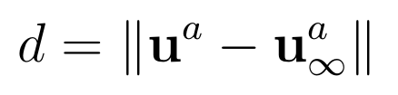
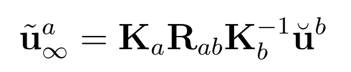

# Step 4: Finish `DltPointsEstimator`

Go to `DltPointsEstimator` in [lab_simple_vo.py](../lab_simple_vo.py). 
Read through the code to get an overview. 

Your task will now be to implement a general disparity check so that you can triangulate all points with a minimum of disparity.

## 6. Compute disparity for the general two-view case
From equation (3.46) in our [VSLAM handbook](https://github.com/tussedrotten/vslam-handbook) we have that the disparity in the general case is given by

where

Compute these disparities for all correspondences.

## 7. Triangulate points.
The final step will be to triangulate all valid correspondences.
For this, you will need to:
- Compute the projection matrix **P** for each camera.
- Use [cv::triangulatePoints()](https://docs.opencv.org/4.5.5/d9/d0c/group__calib3d.html#gad3fc9a0c82b08df034234979960b778c)

You should now be able to run and test the complete lab. 

Make sure the image window is in focus:
- Press \<space\> to do 2-view pose estimation and 3D reconstruction.
- Press \<space\> again to construct a 3D map.
  - You will now use the Motion-only pose estimator to estimate motion relative to this map.
- Press \<space\> again to construct a new 3D map based on the last keyframe and the current frame.
- Continue moving around by creating new maps!

- Press \<r\> to reset the map.
- Press \<q\> to quit.

## Experiments
How does the very *naive* VO method work?
- Try moving around, ending up at the same position as you started. 
  Is the estimated pose near the starting pose?
- Is SOBA necessary in this application?
- Can you construct a 3D model while moving towards or away from the scene?
- You might find the matching a bit jittery. How does SIFT work for example?
- Play around with parameters!
- Study the code for SOBA.
